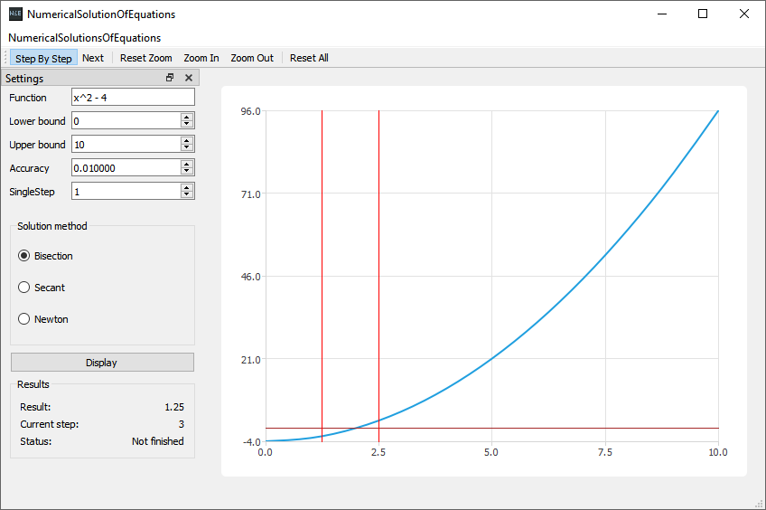

# Numerical Solution Of Equations

> Math school project

## Screenshot

## Scope

This program solves equation using 3 different numerical methods 
([Bisection](https://en.wikipedia.org/wiki/Bisection_method), 
[Secant](https://en.wikipedia.org/wiki/Secant_method), 
[Newton](https://en.wikipedia.org/wiki/Newton%27s_method))

Other resources about Numerical Solutions Of Equations can be found 
[here](http://cfd.mace.manchester.ac.uk/twiki/pub/Main/TimCraftNotes_All_Access/cfd1-numanal.pdf) and 
[here](https://en.wikibooks.org/wiki/Numerical_Methods/Equation_Solving).

## Libraries

- Qt

- exprtk

## exprtk info

This project uses exprtk for expression parsing and evaluation, for more info look in the [GitHub repo](https://github.com/ArashPartow/exprtk)

## License
[MIT License](LICENSE.md)